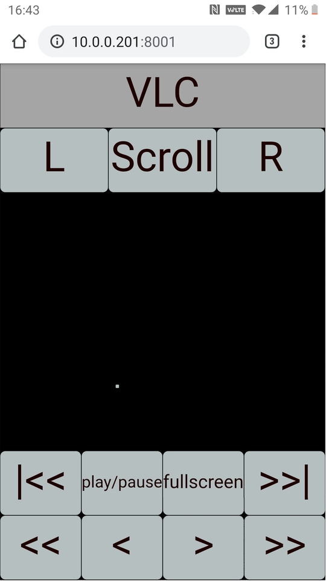

# mousepage
use your phone as a mouse for your computer!  also configure custom shortcut buttons for specific apps.

configs for various apps are in configs/

you can create an (unformatted) example prefs file with `mousepage --writeprefs <filename>`.

currently there's an audacity config, a vlc config, and a plain mouse config.

start the server with `mousepage <config file>`, navigate to the page with your phone or tablet, there you go.

**example ui**

In addition to the mouse controls, the vlc config has various buttons that cause mousepage to issue shortcut key presses.



**prefs**

Prefs are in s-expression format.  Here's the example prefs with some explanatory comments.

```Scheme
((prefs (xmult . 1000.0)  ; prefs section for port and some mouse feel params.
        (ymult . 1000.0)
        (max_tap_duration . 100)
        (show_press_duration . #f)  ; use #t and #f for true/false
        (scroll_threshold . 10)
        (html_port . 8001)
        (websocket_port . 9001)
        )
 (gui  ; gui section has 'title' and 'control'.
        (title . "example")  ; title bar of the web page.
        (control Sizer  ; top control is typically a Sizer.  
                        ; Sizer has orientation (Horizontal/Vertical)
                        ; controls (list of controls)
                        ; proportion (number indicating relative size of a control
                        ;             compared to others in a list.)
                  (orientation . Vertical) 
                  (controls (Sizer (orientation . Horizontal)
                                    ; labels just show static text.
                                   (controls (Label (label . "label1")
                                                    (proportion)
                                                    )
                                               (Label (label . "label2")
                                                      (proportion)
                                                      )
                                             )
                                   (proportion 0.10000000149011612)
                                   )
                             (Sizer (orientation . Horizontal)
                                    ; for MouseButton 'button' values look in buildlisp.rs
                                    (controls (MouseButton (label "L")
                                                           (button . LeftButton)
                                                           (proportion)
                                                           )
                                       ; holding scroll button down cause the mousexy 
                                       ; area to be in scroll mode.
                                              (ScrollButton (label "Scroll")
                                                            (proportion)
                                                            )
                                              (MouseButton (label "R")
                                                           (button . RightButton)
                                                           (proportion)
                                                           )
                                              )
                                    (proportion 0.10000000149011612)
                                    )
                            ; MouseXy moves the mouse around like a touchpad.
                             (MouseXy (label)
                                      (proportion 0.5)
                                      )
                             (Sizer (orientation . Horizontal)
                                    (controls
                              ; key controls contain a list of keys.  
                              ; see buildlisp.rs for a list of valid key symbols to
                              ; use here.  For multiple keys (like ctrl-shift-z) you can
                              ; do: (key LControlKey LShiftKey ZKey) 
                              ; keys are pressed from left to right, and released right to left.
                                            (Key (label "Enter Key")
                                                 (keys EnterKey)
                                                 (proportion 0.10000000149011612)
                                                 )
                                            )
                                    (proportion) ; empty proportion is optional
                                    )
                            )
                  (proportion)
                 )
       )
  ; see buildlisp.rs for a list of valid 'color' symbols.
  (colors (((color . Text)
             (hexstring . "FF0000")
            )))
 )
```
